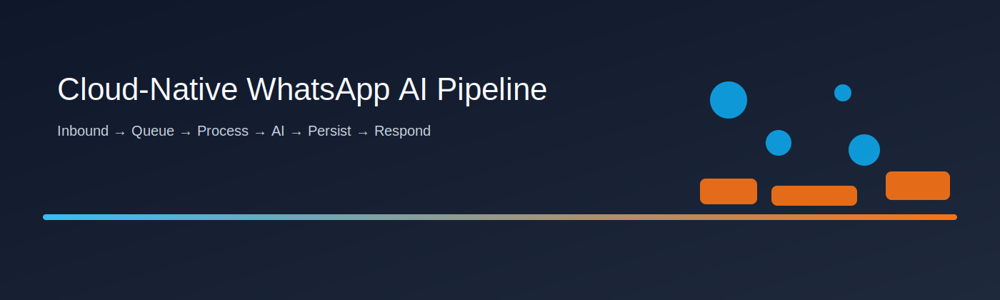
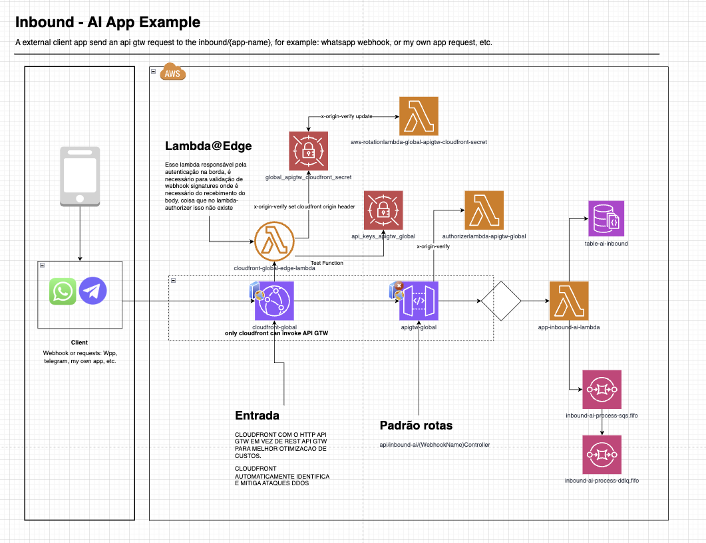
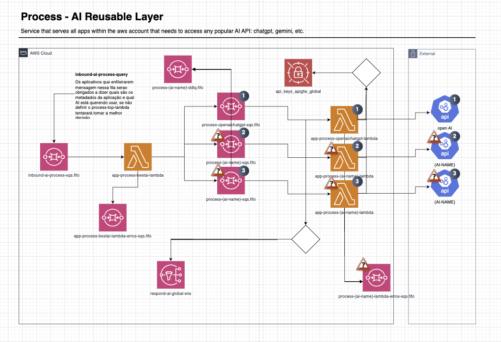
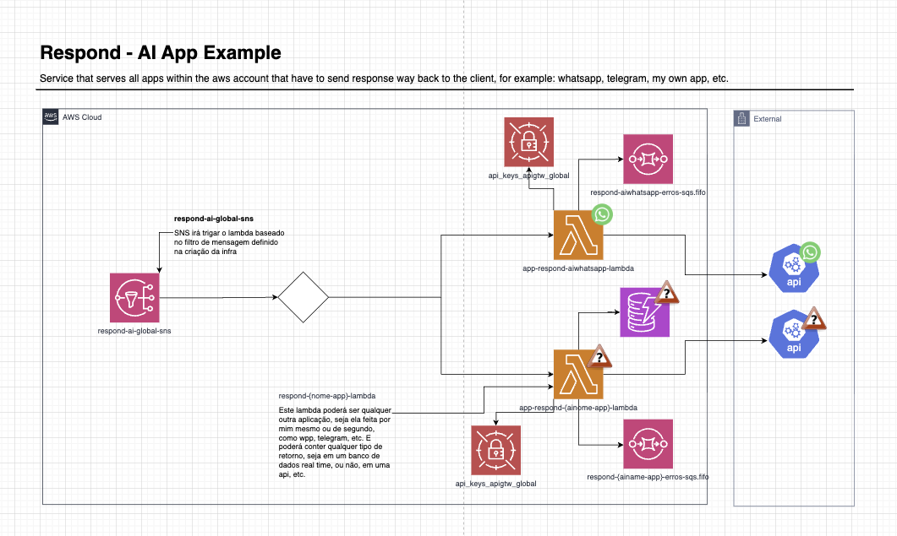

# Cloud-Native WhatsApp AI Pipeline (Monorepo)

## 30-second overview
A production-style, cloud-native AWS system that ingests WhatsApp webhooks, buffers traffic via queues, processes messages with AI, persists results, and sends responses back to users. The design emphasizes scalability, reliability, and clean security practices for a portfolio-ready backend.

## Architecture
- End-to-end flow: WhatsApp inbound → queue → processing Lambda → AI response → persistence → response Lambda.
- Details: see `docs/architecture.md`.
- Diagram sources: `docs/diagrams/example-architecture.drawio`.
- Visuals:

- More Visuals: 
  - `docs/diagrams/inbound-flow.svg`
  - `docs/diagrams/process-layer.svg`
  - `docs/diagrams/respond-flow.svg`

## Key features
- Async processing with SQS + DLQ.
- Scalable serverless Lambdas with concurrency controls.
- Infrastructure-as-code via Terraform.
- CI-ready structure with lint/test/validate workflows.
- Security-first secret handling (env vars + GitHub Secrets + optional SSM/Secrets Manager).

## Repo map
- `services/`: application Lambdas and service code.
- `infra/`: Terraform modules and infrastructure components.
- `docs/`: architecture, security docs, and diagrams.
- `scripts/`: helper scripts for bootstrap and local runs.
- `reports/`: security scanner reports (gitignored).
- `templates/`: reusable project templates.

## Local run
This repo is designed for serverless workloads; local runs are best-effort and dry-run friendly.

- Bootstrap local env:
  - `./scripts/bootstrap.sh`
- Dry-run guidance:
  - `./scripts/run_local.sh`

Optional local dependencies:
- LocalStack or DynamoDB Local for AWS service emulation.

## Deployment (reference)
Terraform modules live under `infra/`.

Example flow (use a sandbox AWS account):
- `terraform init`
- `terraform plan`
- `terraform apply`

## CI/CD
- GitHub Actions workflows run tests, format checks, and terraform validation.
- Status badges can be added here when workflows are enabled.

## Security
- Secrets are never committed. Use `.env` locally and GitHub Secrets in CI.
- Parameter Store is the default secret source; Secrets Manager is optional.
- See `docs/security.md` for details.
- Gitleaks and TruffleHog reports are stored in `reports/` and ignored.

## Tech stack
- AWS Lambda, API Gateway, SQS, SNS, DynamoDB
- Terraform
- .NET (Lambda services)
- Node.js (edge/authorizer utilities)

## What I'd improve next
- Add contract tests for webhook payloads and response schemas.
- Add load tests to validate queue throughput and Lambda concurrency.
- Extend observability with distributed tracing and dashboards.
- Add blue/green or canary deployments for zero-downtime releases.

## Motivation
I built this to prepare for the AWS certification. While working with AWS at Itau, I wanted to deepen my hands-on skills and prove I could design and deliver a scalable, production-style system. Credential: `https://www.credly.com/badges/0e5e416e-d805-4a71-8dda-39f2797a0f38/linked_in_profile`.

## Credits
Built by Lucas Lucena. If you need to contact me, reach out at `contact@lucaslucena.com` or visit `https://lucaslucena.com`.
