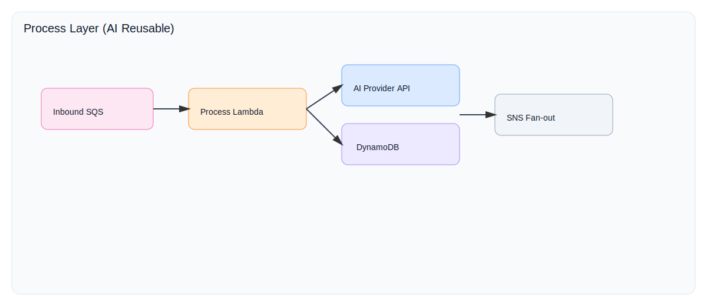

# app-process-openaichatgpt-lambda

## Configuration

Set these environment variables for local use or in your deployment pipeline:

- `OpenAI__ApiKey`
- `AWS__SNS__TopicArn` (non-secret, but environment-specific)

Provide real values via local environment, GitHub Actions secrets, or AWS SSM Parameter Store / Secrets Manager.

